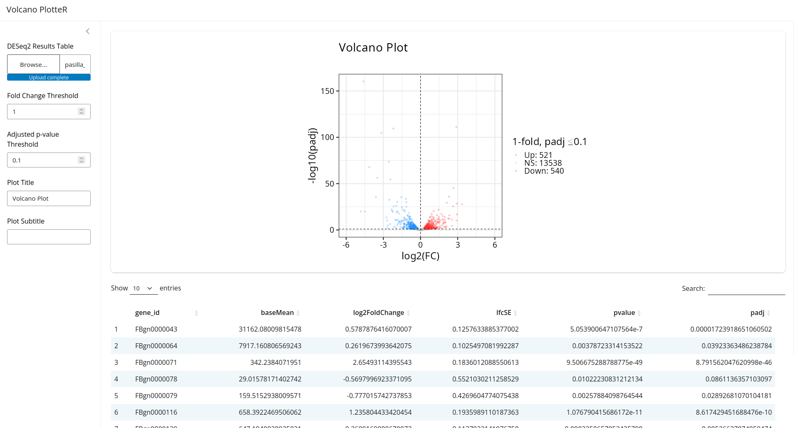
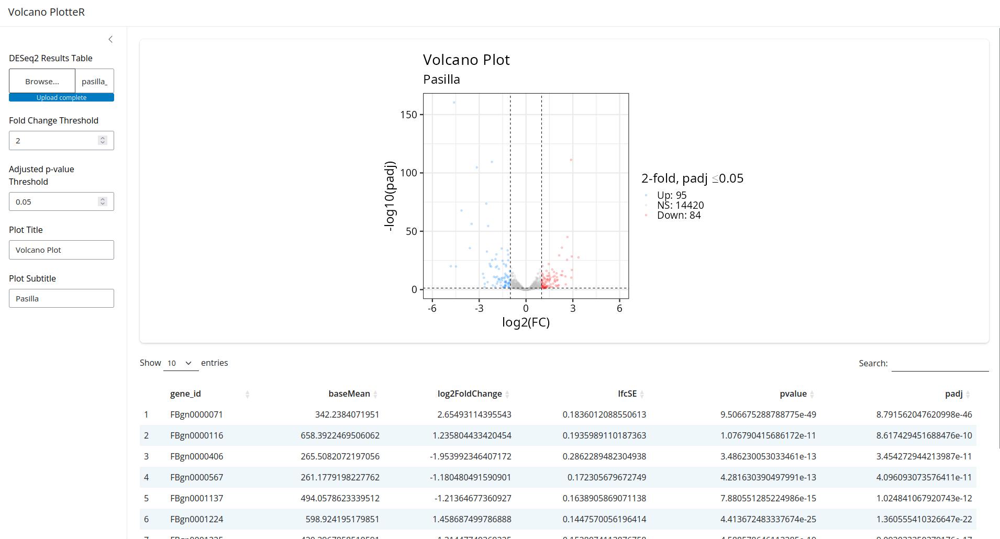

# volcano_rnaseq_shiny_example
An example using R shiny to create a web app that generates volcano plots.

This basic app allows you to load a results table from [DESeq2](https://bioconductor.org/packages/release/bioc/html/DESeq2.html)
and generate a volcano plot with reactive p-value and fold change thresholds.

You can access the test dataset in the "example_data" directory.

## How to Run

The best way to start the app is to use [renv](https://rstudio.github.io/renv/articles/renv.html).

1. Make sure you have R installed, > 4.3 should work.
2. Clone the repository to your local with `git clone`.
3. Enter the local directory with the repository and start the `R` interpreter.
4. Install all dependencies with `renv::restore()`.
5. Start the app with `shiny::runApp("shiny")`.

## Example Images

## Reference

This app uses test data from the R package [`pasilla`](https://bioconductor.org/packages/release//data/experiment/html/pasilla.html):

Huber W, Reyes A (2024). pasilla: Data package with per-exon and per-gene read
counts of RNA-seq samples of Pasilla knock-down by Brooks et al., Genome
Research 2011.. R package version 1.32.0.